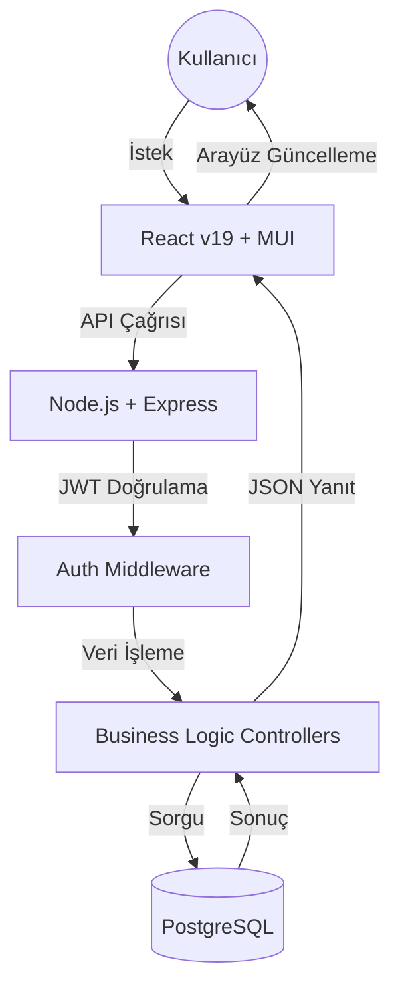

# 🌐 SwapS - Geleceğin Beceri Takas Platformu

<div align="center">


**Modern, hızlı ve güvenli beceri paylaşım ekosistemi.**

[](https://opensource.org/licenses/MIT)
[](https://reactjs.org/)
[](https://nodejs.org/)
[](http://makeapullrequest.com)

[Canlı Demo](https://swaps.com.tr) • [Dokümantasyon](#-dokümantasyon) • [Hızlı Başlangıç](#-kurulum-ve-çalıştırma-docker-ile) • [İletişim](#-yazar)

</div>

---

## 🚀 Proje Vizyonu

**SwapS**, bilginin ve yeteneğin para birimi kadar değerli olduğu bir geleceği hedefler. Kullanıcıların sahip oldukları becerileri (Offering) bir sermaye olarak kullanmalarını, ihtiyaç duydukları becerileri (Seeking) ise topluluk içi yardımlaşma ile kazanmalarını sağlayan merkeziyetsiz bir yardımlaşma modelidir.

---

## 🏗️ Sistem Mimarisi

SwapS, yüksek ölçeklenebilirlik için tasarlanmış modern bir tam yığın (full-stack) mimariye sahiptir.

### 📊 Veri Akış Diyagramı



---

## 📋 Öne Çıkan Özellikler

- **🤖 Akıllı Eşleşme (Reciprocal Matching)**: İki yönlü beceri eşleşmesi algoritması ile doğru kişiyle doğru zamanda tanışın.
- **🏗️ Proje Yönetimi**: Sadece beceri değil, ortak projeler için ekip arkadaşı bulun.
- **💬 Gerçek Zamanlı İletişim**: Anlık mesajlaşma sistemi ile işbirliğine hemen başlayın.
- **🛡️ Güvenli Kimlik Doğrulama**: JWT ve Bcrypt tabanlı endüstri standardı güvenlik katmanı.
- **📱 Kusursuz Responsive Tasarım**: Mobilde ve masaüstünde mükemmel deneyim.

---

## 🛠️ Teknoloji Yığını

### **Frontend**
- **React 19.2.0** & **Vite**
- **Material-UI (MUI) v7**
- **React Router DOM**
- **Axios** & **Emotion**

### **Backend**
- **Node.js** & **Express 5**
- **PostgreSQL** (pg client)
- **JWT (JSON Web Token)**
- **Bcrypt** (Şifre Güvenliği)

### **DevOps & Altyapı**
- **Docker & Docker Compose**
- **Vercel** (Frontend)
- **Render** (Backend)

---

## 🕹️ Kurulum ve Çalıştırma (Docker ile)

Proje, bilgisayarınızdaki mevcut ortamları etkilemeden Docker üzerinde çalışır.

### 1. Hazırlık
- **Docker Desktop**'ın çalıştığından emin olun.
- Projeyi klonlayın:
  ```bash
  git clone https://github.com/bahattinyunus/swapsproject.git
  cd swapsproject
  ```

### 2. Tek Komutla Başlatma
```powershell
docker-compose up -d --build
```

**Sistem Adresleri:**
- **Frontend:** [http://localhost](http://localhost)
- **Backend API:** [http://localhost:3005](http://localhost:3005)
- **Veritabanı:** `localhost:5435`

---

## 💡 Demo Hesaplar

| Rol | Email | Şifre |
| :--- | :--- | :--- |
| **Kullanıcı 1** | `user@gmail.com` | `user` |
| **Kullanıcı 2** | `test@gmail.com` | `test` |
| **Admin** | `admin1@gmail.com` | `admin-1` |

---

## 📡 API Endpoint Özetleri

<details>
<summary><b>🔐 Kimlik Doğrulama</b></summary>

- `POST /api/auth/register` - Yeni kullanıcı kaydı
- `POST /api/auth/login` - Giriş ve Token alma
</details>

<details>
<summary><b>👤 Profil & Beceriler</b></summary>

- `GET /api/profile/:userId` - Profil bilgilerini getir
- `GET /api/skills` - Tüm beceri havuzunu listele
- `POST /user-skills` - Profiline Offering/Seeking beceri ekle
</details>

<details>
<summary><b>🔀 Eşleşme & Mesajlaşma</b></summary>

- `GET /swaps/reciprocal` - Karşılıklı beceri eşleşmelerini getir
- `POST /api/messages` - Mesaj gönder
- `GET /api/messages/conversations` - Tüm konuşmaları listele
</details>

---

## 🧩 Proje Yapısı

```text
swapsproject/
├── backend/             # Node.js Server & Business Logic
│   ├── components/      # Auth, Messages, Skills components
│   ├── config/          # DB connections
│   └── middleware/      # JWT Security
├── frontend/            # React Client
│   ├── src/             # Components, Services, Hooks
│   └── assets/          # Static files
└── docker-compose.yml   # Multi-container orchestration
```

---

## 🤝 Katkıda Bulunma

1. Bu repository'yi **Fork** edin.
2. Feature branch oluşturun (`git checkout -b feature/YeniOzellik`).
3. Değişikliklerinizi **Commit** edin (`git commit -m 'feat: Yeni özellik eklendi'`).
4. Branch'inizi **Push** edin (`git push origin feature/YeniOzellik`).
5. Bir **Pull Request** açın.

---

## 📄 Lisans

Bu proje [MIT Lisansı](LICENSE) altında lisanslanmıştır.

---

## 👨‍💻 Yazar

**Bahattin Yunus Çetin**
*IT Architect*

- **GitHub:** [@bahattinyunus](https://github.com/bahattinyunus)
- **LinkedIn:** [Bahattin Yunus Çetin](https://linkedin.com/in/bahattinyunus)
- **E-posta:** bahattinyunuscetin@gmail.com

---
<p align="center">
  <i>"Bilgi paylaştıkça çoğalır."</i><br>
  <b>Happy Swapping!</b>
</p>
